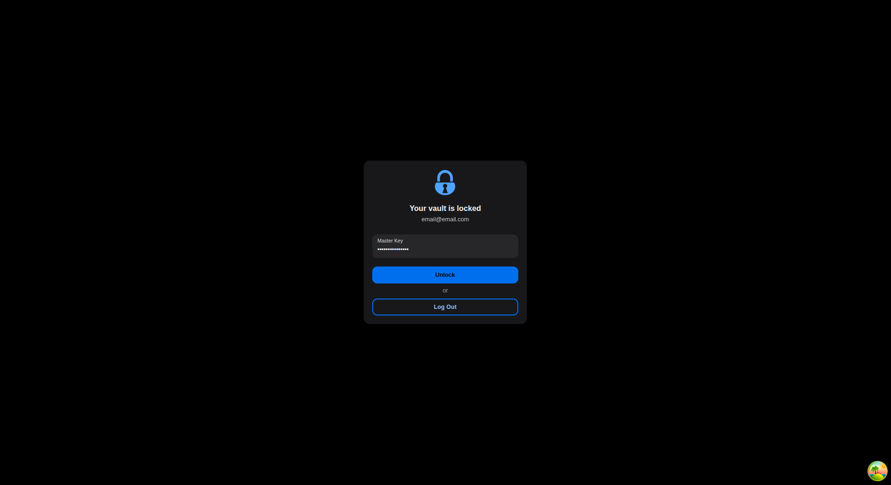
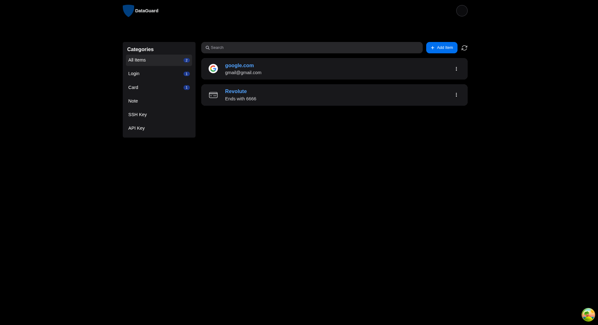

# 🔐 Data Guard

Data Guard is a serverless **password manager** built on **AWS Lambda microservices** with **WebSocket updates** and a **React + TypeScript frontend**.

---

## 🚀 Features

- Secure storage for passwords and secrets
- Real-time updates with WebSockets
- Serverless backend on AWS
- Modern frontend in React + TypeScript

---

## 🏗️ Setting Up

```bash
cd backend
npm install
npm run build
npm run deploy:prod
# deploy with AWS SAM or CDK
```

## 🖼️ Screenshots



